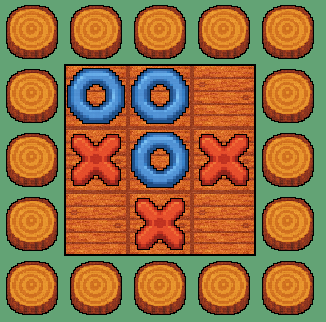

# Tic Tac Toe

A classic Tic Tac Toe game built in Godot Engine. This repository contains the project files, game logic, and art assets necessary to play a two-player (local) game of Tic Tac Toe.

---

## Overview

Tic Tac Toe (also known as Noughts and Crosses) is a simple strategy game for two players (X and O). Players take turns marking a 3×3 grid. The first player to align three of their marks horizontally, vertically, or diagonally wins. If all nine cells are filled without a winner, the game ends in a draw.

This Godot project implements the game mechanics, UI, and basic art assets. It’s designed to be a learning template for game development in Godot and to serve as a foundation for further enhancements.

---

## Features

- **Two-player local gameplay**: Players alternate turns on the same device.
- **Win detection**: Automatically checks for horizontal, vertical, and diagonal winning lines.
- **Draw detection**: Recognizes when the board is full with no winner.
- **Restart button**: Quickly reset the board to play again.
- **Placeholder art assets**: Simple X and O sprites, with an easy-to-update art pipeline.

---

## Getting Started

Follow these instructions to set up and run the Tic Tac Toe game in Godot.

### Prerequisites

- [Godot Engine 4.x](https://godotengine.org/) installed
- (Optional) A graphics editor for custom art (e.g., Aseprite, Photoshop, GIMP)

### Installation

1. **Clone the repository**:

   ```bash
   git clone https://github.com/yourusername/tic-tac-toe-godot.git
   cd tic-tac-toe-godot
   ```

2. **Open the project** in Godot:

   - Launch Godot Engine.
   - Click **Import** and select the project folder (the directory containing `project.godot`).
   - Press **Edit** to open the project.

3. **Run the game**:

   - In Godot’s scene panel, ensure `Main.tscn` (or `Board.tscn`) is the active scene.
   - Press the **Play** button (F5) to start the game.

---

## Game Rules

1. Player X goes first.
2. Players alternate turns placing their symbol in any empty cell.
3. The first player to align three symbols in a row (horizontal, vertical, or diagonal) wins.
4. If all nine cells are filled without a winning line, the game is a draw.

---

## Controls

- **Click or tap** on an empty cell to place X or O.
- **Restart**: Click the **Restart** button on-screen after a game ends to reset the board.

---

## Art Assets

The `assets/` folder contains placeholder X and O sprites (64×64 px). To replace or improve the art:

1. Create or edit your sprite in your preferred graphics editor.
2. Export as PNG (64×64 px) with transparency.
3. Replace `x.png` and/or `o.png` in the `assets/players/` folder.
4. In Godot, reimport the textures (right-click → **Reimport**).


Example board:



---

## Contributing

Contributions are welcome! Feel free to open issues or submit pull requests to add features, polish art, or optimize code.

---

## License

This project is licensed under the MIT License. See [LICENSE](LICENSE) for details.

